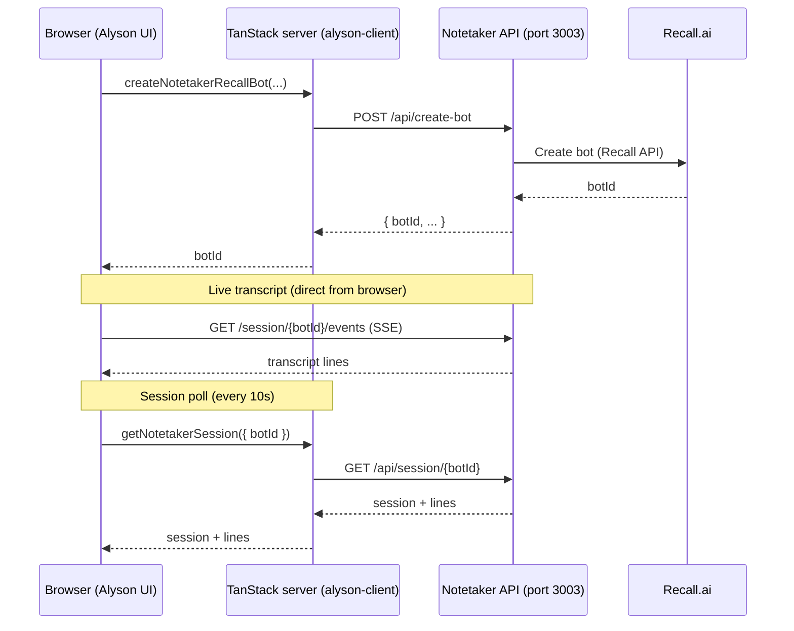

<div align="center">

# Alyson HR Client

**TanStack Start · React · Clerk · Supabase · S3**

Web app for team directory, org chart, HR ops, and meeting notetaker.

</div>

---

## Quick start

```bash
npm install
npm run dev          # UI on http://localhost:3000
npm run dev:ops      # UI + notetaker base URL pointed at localhost:3003
```

Copy `.env` from your team vault. See [Environment variables](#environment-variables) below.

### Related docs

| Doc | Topic |
|-----|--------|
| [orgchart.md](./orgchart.md) | Org chart UI, S3 bucket layout, audit logs |
| [boarding.md](./boarding.md) | Onboarding / offboarding workflow spec |
| [notetaker-architecture.md](./notetaker-architecture.md) | Notetaker + Recall flow, endpoints, file map |

---

## Alyson Notetaker — Create Bot flow

> **Full architecture doc:** [notetaker-architecture.md](./notetaker-architecture.md) (endpoints, webhooks, SSE, folder/file map, billing).

The **Create** button on `/alyson-notetaker` does **not** call Recall.ai from the browser. The UI talks to this app’s server, which proxies to a **separate notetaker service** (default `http://localhost:3003`). That service holds `RECALL_API_KEY` and joins the meeting.

### Architecture (3 layers)



### 1) What you click in the UI

| Item | Location |
|------|----------|
| Page | `/alyson-notetaker` |
| Form | `CreateBotForm` in `src/routes/alyson-notetaker/index.tsx` |
| Server fn | `createNotetakerRecallBot` in `src/lib/alyson-notetaker-functions.ts` |

On **Create**, the form sends:

- `meeting_url` — Zoom / Meet / Teams link  
- `bot_name` — display name in the call  
- `title` — optional session label  
- `avatar_jpeg_b64` — optional JPEG (base64, no `data:` prefix) built from `/images/alyson-mini.svg` for the bot’s video tile  

### 2) Browser → this app (TanStack server function)

The browser calls **`createNotetakerRecallBot({ data: {...} })`**. That is a TanStack Start **server function** (RPC on the same origin as the app, e.g. `http://localhost:3000` in dev). It is **not** exposed as `POST /api/create-bot` on the Vite app itself.

### 3) This app → notetaker service (real HTTP)

The server handler validates input, then:

```http
POST {ALYSON_NOTETAKER_BASE_URL}/api/create-bot
Content-Type: application/json
```

**Base URL** (first match wins):

| Env var | Purpose |
|---------|---------|
| `ALYSON_NOTETAKER_BASE_URL` | Server-side proxy target |
| `VITE_ALYSON_NOTETAKER_BASE_URL` | Client SSE + build-time |
| `TEST_BOTV2_BASE_URL` / `VITE_TEST_BOTV2_BASE_URL` | Legacy aliases |
| *(default)* | `http://localhost:3003` |

**Example request body:**

```json
{
  "meeting_url": "https://meet.google.com/xxx-xxxx-xxx",
  "bot_name": "Notetaker",
  "title": "Live meeting",
  "automatic_video_output": {
    "in_call_recording": { "kind": "jpeg", "b64_data": "<base64...>" },
    "in_call_not_recording": { "kind": "jpeg", "b64_data": "<base64...>" }
  }
}
```

**Example response** (used by the UI):

```json
{
  "botId": "<recall-bot-id>"
}
```

The notetaker service (separate repo/process) calls **Recall.ai** and joins `meeting_url`. Webhooks from Recall hit the notetaker server at `PUBLIC_WEBHOOK_BASE_URL`, not this client.

### 4) After the bot is created

| Step | Caller | Endpoint / mechanism |
|------|--------|----------------------|
| Refresh session list | Browser → server fn | `listNotetakerSessions()` → `GET /api/sessions` |
| Select session | UI | `setPicked(botId)` |
| **Live transcript** | **Browser → notetaker directly** | `EventSource` → `GET {base}/session/{botId}/events` (SSE) |
| Session + stored lines | Browser → server fn (poll ~10s) | `getNotetakerSession` → `GET /api/session/{botId}` |
| Generate notes | Browser → server fn | `POST /api/session/{botId}/notes` |
| Persist to S3 | Browser → server fn | `finalizeAndPersistNotetakerSession` → `alyson-notetaker/...` in S3 |

**SSE URL** (browser, from `SessionPanel`):

```
GET {VITE_ALYSON_NOTETAKER_BASE_URL}/session/{botId}/events
```

Use the **same port** for create-bot and SSE (e.g. `npm run dev:ops` sets both to `3003`). If `VITE_ALYSON_NOTETAKER_BASE_URL` is unset, the UI may default SSE to `3002` while the server uses `3003`.

### 5) Notetaker API surface (proxied by this repo)

Defined in `src/lib/alyson-notetaker-functions.ts` via `upstream()`:

| Method | Path | Purpose |
|--------|------|---------|
| `POST` | `/api/create-bot` | Create Recall bot, join meeting |
| `GET` | `/api/sessions` | List bot sessions |
| `GET` | `/api/session/:botId` | Session metadata + transcript lines |
| `GET` | `/session/:botId/events` | Live transcript (SSE; browser only) |
| `POST` | `/api/session/:botId/notes` | Generate meeting notes |

### 6) Persistence

| When | Where |
|------|--------|
| During meeting | Notetaker service (in-memory / its store) |
| Meeting ended | `getNotetakerSession` may auto-persist → `.alyson/notetaker-db` (local) |
| Manual **Persist** | S3: `alyson-notetaker/transcripts/`, `meetingnotes/`, session index |

### 7) Quick test (notetaker server must be running)

```bash
curl -X POST http://localhost:3003/api/create-bot \
  -H "Content-Type: application/json" \
  -d '{"meeting_url":"YOUR_MEETING_URL","bot_name":"Notetaker","title":"Test"}'
```

### 8) Notetaker server configuration

The UI shows a warning if Recall is not configured on the **notetaker** process:

- `RECALL_API_KEY`
- `PUBLIC_WEBHOOK_BASE_URL`
- Optional Groq keys for notes generation

Run the notetaker backend alongside this client (`npm run dev:ops` only wires the URL; it does not start the notetaker process).

---

## Environment variables

| Variable | Used for |
|----------|----------|
| `NEXT_PUBLIC_CLERK_PUBLISHABLE_KEY` | Clerk auth (browser) |
| `VITE_SUPABASE_URL` / `VITE_SUPABASE_PUBLISHABLE_KEY` | Supabase client |
| `ALYSON_NOTETAKER_BASE_URL` / `VITE_ALYSON_NOTETAKER_BASE_URL` | Notetaker proxy + SSE |
| `AWS_REGION`, `AWS_ACCESS_KEY_ID`, `AWS_SECRET_ACCESS_KEY` | S3 (org chart, HR overview, notetaker) |
| `ALYSON_HR_ORGCHART_S3_BUCKET` | Org chart bucket (default `alyson-hr-orgchart`) |
| `ALYSON_HR_S3_BUCKET` / `ALYSON_HR_S3_KEY` | Team overview snapshot |
| `VITE_HR_OVERVIEW_SOURCE` | Optional: `s3` or `supabase` for team directory |

---

## Unified Meetings Setup

Unified Meetings is available at `Alyson Notetaker -> Unified Meetings` and shows company meetings in the next 24 hours using Google Workspace Domain-Wide Delegation (DWD).

### DWD prerequisites

- Service account credentials are configured either via `GOOGLE_DWD_SERVICE_ACCOUNT_JSON` (recommended for deployment) or local file path `GOOGLE_APPLICATION_CREDENTIALS` (local dev)
- Domain-wide delegation is enabled for the service account client id
- Required scopes approved in Google Admin:
  - `https://www.googleapis.com/auth/admin.directory.user.readonly`
  - `https://www.googleapis.com/auth/calendar.events.readonly`

### Required env vars

```env
GOOGLE_APPLICATION_CREDENTIALS=D:\google-calendar\alyson-dwd.json
GOOGLE_DWD_SERVICE_ACCOUNT_JSON=
GOOGLE_WORKSPACE_DOMAIN=cintara.ai
GOOGLE_WORKSPACE_ADMIN_SUBJECT_EMAIL=thirumalai@cintara.ai
GOOGLE_DWD_SERVICE_ACCOUNT_EMAIL=alyson-calendar-sync@tempdata-494013.iam.gserviceaccount.com
GOOGLE_DWD_SERVICE_ACCOUNT_CLIENT_ID=116466681296516011628
GOOGLE_PROJECT_ID=tempdata-494013
RECALL_API_KEY=
RECALL_REGION=ap-northeast-1
RECALL_BASE_URL=https://ap-northeast-1.recall.ai
BOT_NAME=Alyson Notetaker
```

### Run and use

1. Start app: `npm run dev`
2. Open `Alyson Notetaker -> Unified Meetings`
3. Dashboard auto-refreshes every 60 seconds (manual Refresh is also available)
4. **No Vercel cron / bulk schedule** — company-wide auto-schedule is disabled
5. Alyson join time is `startTime - 2 minutes`
6. Use per-row **Schedule Alyson** on Unified Meetings for each meeting you want

### API endpoints

- `GET /api/analytics/unified-meetings`
- `POST /api/analytics/unified-meetings/refresh`
- `POST /api/analytics/unified-meetings/:meetingId/schedule` (per meeting)
- `GET|POST /api/analytics/unified-meetings/schedule-bots` → **410 disabled** (was cron + bulk)

---

## Useful scripts

| Command | Description |
|---------|-------------|
| `npm run dev` | Vite dev server (port 3000) |
| `npm run dev:ops` | Dev + notetaker URLs → `localhost:3003` |
| `npm run seed:revcloud` | Seed RevCloud roster to HR overview S3 |
| `npm run inspect:orgchart` | Print org-chart S3 state (terminations, additions, logs) |

