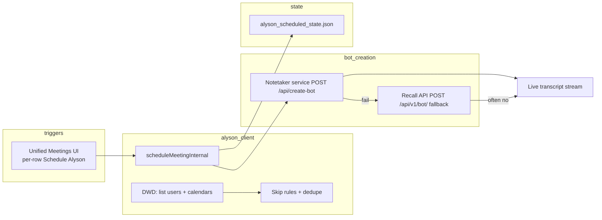

# Alyson Bot Auto-Join — Blocker Document

**Product:** Alyson HR / Alyson Notetaker  
**Feature:** Unified Meetings — automated calendar scan + Recall bot scheduling (Fireflies-style)  
**Last updated:** May 2026  
**Status:** Partially working in dev; production reliability and parity gaps remain

---

## 1. Executive summary

We built an automated pipeline that:

1. Reads company Google Calendars (next 24h) via **Domain-Wide Delegation (DWD)**  
2. Normalizes meetings and applies **skip rules** (no link, OOO, past start, etc.)  
3. Schedules **one Alyson bot per meeting** (dedupe: `meetingUrl + startTime`)  
4. Joins **2 minutes before** start (or immediately if join time is already past)  
5. Surfaces bots in **Unified Meetings** and (when configured correctly) **live transcripts** in Alyson Notetaker  

**Goal:** Schedule Alyson selectively (per meeting / future email allowlist). **Company-wide cron and bulk schedule are disabled** (May 2026).

**Current gap vs Fireflies:** Calendar automation exists, but **production durability**, **Notetaker/Recall billing**, and **live transcript consistency** are not yet at “set and forget” quality.

---

## 2. How scheduling works today

| Step | Mechanism |
|------|-----------|
| Calendar discovery | Admin SDK + Calendar API, impersonate each active Workspace user |
| Eligibility | `shouldBotJoin` when skip rules pass (all active users in current code) |
| Dedupe | One bot per `meetingUrl \| startTime` (not per attendee) |
| Join time | `startTime - 2 minutes`, or now if that time passed but meeting not started |
| Preferred bot path | `ALYSON_NOTETAKER_BASE_URL` → `/api/create-bot` (same as manual Notetaker) |
| Fallback | Direct Recall API with `RECALL_API_KEY` |
| Automation | **Disabled** — was `vercel.json` cron → `schedule-bots`; use per-meeting `/:meetingId/schedule` only |
| Scheduled state | File: `alyson_scheduled_state.json` (local or `/tmp` on Vercel) |

---

## 3. What is working

- Unified Meetings UI: list meetings, filters, manual **Schedule Alyson**, bot status, bot ID copy  
- DWD calendar scan for `GOOGLE_WORKSPACE_DOMAIN` users (when credentials/scopes are valid)  
- ~~Auto-schedule cron (every 5 minutes)~~ **removed / disabled** — manual per-meeting only  
- One-bot-per-meeting deduplication  
- Manual schedule optimized (single event fetch vs full-domain rescan)  
- Notetaker-managed bots → live transcripts (when Notetaker service + Recall credits are healthy)  
- IST timestamps and session title format `DDMMYYYY <meeting title>` in Notetaker UI  

---

## 4. Blockers

### P0 — Must fix for trustworthy production

| ID | Blocker | Impact | Owner / dependency | Mitigation |
|----|---------|--------|-------------------|------------|
| B1 | **Scheduled state is ephemeral on Vercel** (`/tmp` or local file). Cold starts / redeploys lose dedupe history; risk of **duplicate bots** or lost bot IDs. | Duplicate Recall usage, broken session linkage | Eng — persist to **S3**, Redis, or DB | Use same S3 bucket pattern as Notetaker sessions; env `ALYSON_SCHEDULED_STATE_PATH` or S3 key |
| B2 | **Notetaker `create-bot` fails when Recall account has insufficient credits** (`insufficient_credit_balance`). System falls back to **direct Recall** from HR app key. | Bot may join but **no live transcripts** in Alyson Notetaker | Ops / Recall billing on **Notetaker service** Recall key | Fund Recall account used by Notetaker service; alert on fallback rate; block fallback in prod or show UI warning |
| B3 | **Notetaker service must be reachable from Vercel** (`ALYSON_NOTETAKER_BASE_URL`). If URL is `localhost:3003` or private network, auto-schedule silently fails or only uses fallback. | No bots or no live pipeline in production | DevOps — deploy Notetaker service with public/stable URL | Set production URL in Vercel env; health check from schedule job |
| B4 | **Two Recall API keys** (Notetaker service vs `RECALL_API_KEY` on HR client) with different credit pools. Unclear which key joins production meetings. | Confusion, failed schedules, billing surprises | Product + Ops | Single billing owner; document which key is canonical; prefer one creation path only |

### P1 — Reliability and scale

| ID | Blocker | Impact | Owner / dependency | Mitigation |
|----|---------|--------|-------------------|------------|
| B5 | **Full-domain calendar scan** on each schedule run is slow (many users × pagination). Cron + manual actions can **timeout** on serverless (10–60s limits). | Missed meetings, partial schedules | Eng | Cache meetings 60s (exists); incremental scan; queue workers; schedule only delta |
| B6 | **Google DWD scopes** must be authorized in Admin Console for service account Client ID. Missing scopes → scan or schedule failures. | Feature appears broken | Google Workspace admin | Document required scopes in README; diagnose endpoint (was built then rolled back — can restore) |
| B7 | **HR roster email domain** (`@revcloud.com` in seed data) vs **Workspace domain** (`@cintara.ai`). Wrong email → DWD impersonation fails for that person. | User not in automation | HR data + Eng | Complete domain migration in roster/S3; map aliases in Directory |
| B8 | **Cron auth**: optional `ALYSON_SCHEDULE_CALENDAR_CRON_SECRET` — if set, cron must send `Authorization: Bearer …`. Misconfiguration stops automation. | Auto-join stops with 401 | DevOps | Document in Vercel cron headers; monitor cron logs |

### P2 — Product parity (Fireflies-like)

| ID | Blocker | Impact | Owner / dependency | Mitigation |
|----|---------|--------|-------------------|------------|
| B9 | No **per-user opt-in/opt-out** for auto-join (domain-wide on for all eligible meetings). | Privacy / compliance concerns | Product / Legal | User or admin toggles; organizer-only rules |
| B10 | No **post-meeting email** or CRM push of transcripts. | Not full Fireflies parity | Product | Resend + attendee directory (discussed, not built) |
| B11 | **Workspace activity** (Team drawer metrics) rolled back — needs extra DWD scopes; was blocked by `unauthorized_client` until Admin approves Gmail/Drive/Chat scopes. | No usage analytics in HR | Google Admin + Eng | Re-enable after scopes approved |
| B12 | **Bot lifecycle visibility** limited (scheduled vs in-call vs failed vs completed). | Hard to debug “did Alyson join?” | Eng | Poll Recall bot status; show in Unified Meetings + Notetaker |
| B13 | **Non–Google Meet** links (Zoom/Teams) may appear on calendar but behavior untested. | Bot may not join | Product | Detect platform; skip or separate Recall config |

---

## 5. Environment & infrastructure checklist

| Variable / config | Required for |
|-------------------|--------------|
| `GOOGLE_DWD_SERVICE_ACCOUNT_JSON` or `GOOGLE_APPLICATION_CREDENTIALS` | Calendar scan |
| `GOOGLE_WORKSPACE_DOMAIN`, `GOOGLE_WORKSPACE_ADMIN_SUBJECT_EMAIL` | DWD impersonation |
| `GOOGLE_DWD_SERVICE_ACCOUNT_CLIENT_ID` | Admin Console DWD delegation |
| `RECALL_API_KEY`, `RECALL_BASE_URL`, `RECALL_REGION` | Direct Recall fallback |
| `BOT_NAME` | Bot display name in Meet |
| `ALYSON_NOTETAKER_BASE_URL` | Preferred bot + live transcripts |
| `ALYSON_SCHEDULED_STATE_PATH` | Writable state in serverless (e.g. `/tmp/...`) |
| `ALYSON_SCHEDULE_CALENDAR_CRON_SECRET` | Unused while cron disabled |
| Vercel cron in `vercel.json` | **Do not enable** until email allowlist exists |

**DWD scopes currently required (Unified Meetings):**

- `https://www.googleapis.com/auth/admin.directory.user.readonly`
- `https://www.googleapis.com/auth/calendar.events.readonly`

---

## 6. Risks

| Risk | Likelihood | Severity |
|------|------------|----------|
| Duplicate bots after deploy (lost dedupe state) | Medium | High (cost + user trust) |
| Bots join without transcripts (Recall fallback) | Medium | High |
| Recall credit exhaustion | Medium | High |
| Google API quota / rate limits at company size | Low–Medium | Medium |
| Users not informed Alyson records meetings | Medium | Compliance |

---

## 7. Recommended next steps (priority order)

1. **Persist scheduled-bot state to S3** (same account/bucket as Notetaker).  
2. **Fix Notetaker service Recall credits**; disable or flag direct Recall fallback in production.  
3. **Set production `ALYSON_NOTETAKER_BASE_URL`** and verify `create-bot` from Vercel.  
4. **Align HR roster emails** with `@cintara.ai` Workspace accounts.  
5. Add **monitoring**: cron success, bots scheduled/joined/failed, fallback count.  
6. Product rules: **opt-out**, external-only, organizer-only (if required).  

---

## 8. Open questions for stakeholders

Use these in planning meetings, Google/Recall setup calls, or internal reviews.

### Product & policy

1. Should **every** Workspace user’s meetings get a bot by default, or only specific teams/roles?  
2. Do we need **explicit consent** (banner/email) before recording company-wide?  
3. Should Alyson join **external-only** meetings, **internal-only**, or both?  
4. What is the policy for **1:1s**, **interviews**, and **confidential / board** meetings?  
5. Should the **organizer** be able to remove Alyson from a single occurrence without disabling global automation?  
6. Is **Fireflies parity** the bar (auto-join + transcript + summary + email), or is **auto-join + live transcript** enough for v1?  

### Google Workspace & calendar

7. Is DWD approved for **all** users in `cintara.ai`, or only a pilot group?  
8. Who owns the **service account** and **Client ID** in Admin Console long term?  
9. Are meetings on **secondary calendars** / delegated calendars in scope, or only `primary`?  
10. How do we handle **recurring series** vs single instances for dedupe and bot scheduling?  
11. After **domain migration** (revcloud → cintara), are all employee Workspace accounts active and calendar-backed?  

### Scheduling & bot behavior

12. Is **join 2 minutes early** correct, or should we join at start time / on first participant?  
13. What should happen if the meeting **starts early** or the link changes after we scheduled?  
14. Is **one bot per meeting** (shared Meet link) correct when 10 employees have the same event?  
15. What is the maximum acceptable **delay** between meeting creation and Alyson appearing on the schedule (cron is 5 min)?  
16. Should we **cancel/reschedule** the Recall bot when the calendar event is cancelled or moved?  

### Recall & Notetaker technical

17. Which **Recall API key / account** is production-canonical — Notetaker service or HR client?  
18. What is the **monthly Recall budget** and expected meeting volume (bots × hours)?  
19. Must every bot go through **Notetaker `/api/create-bot`** for live transcripts, or is direct Recall acceptable for any case?  
20. Where does the **Notetaker service** run in production (URL, region, SLA)?  
21. Do we need **separate Recall regions** per geography (current: `ap-northeast-1`)?  

### Operations & support

22. Who gets paged when **cron fails** or **0 bots scheduled** for a day?  
23. How do support staff look up **bot ID ↔ meeting ↔ transcript** for a user report?  
24. What is the **retention** policy for transcripts (S3, Recall, deletion on request)?  
25. How do we report **daily adoption** (“who used Alyson / who didn’t”) — required earlier, not yet built?  

### Security & compliance

26. Are **recorded meetings** covered under existing employment / privacy policies?  
27. Do we need **super-admin lock** on sensitive transcripts (feature exists elsewhere in Notetaker)?  
28. Is storing **service account JSON** in Vercel env (`GOOGLE_DWD_SERVICE_ACCOUNT_JSON`) approved by security?  

---

## 9. Decision log (fill as you go)

| Date | Decision | Rationale |
|------|----------|-----------|
| | | |
| | | |

---

## 10. References in repo

| Area | Location |
|------|----------|
| Scheduling logic | `src/lib/unifiedMeetingsService.ts` |
| Cron | `vercel.json` |
| API routes | `src/routes/api/analytics/unified-meetings*.ts` |
| UI | `src/routes/alyson-notetaker/analytics.unified-meetings.tsx` |
| Notetaker sessions | `src/lib/alyson-notetaker-functions.ts` |
| Setup docs | `README.md` → Unified Meetings Setup |

---

*For questions or updates to this doc, assign an owner and link related tickets/PRs in section 9.*
